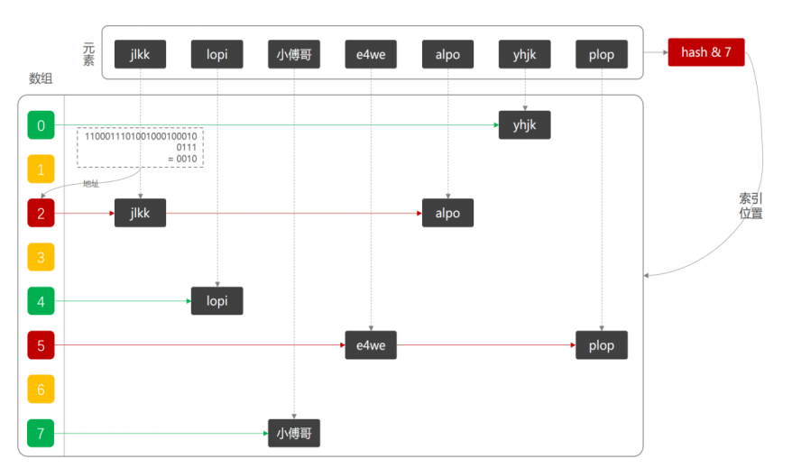
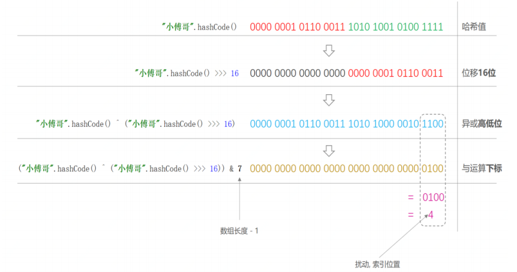
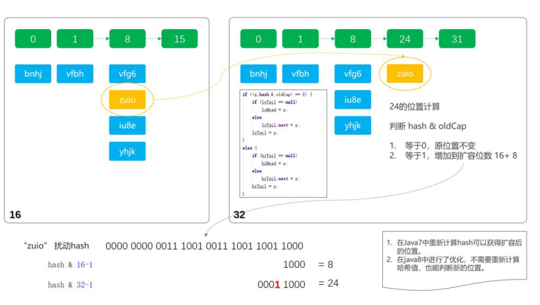
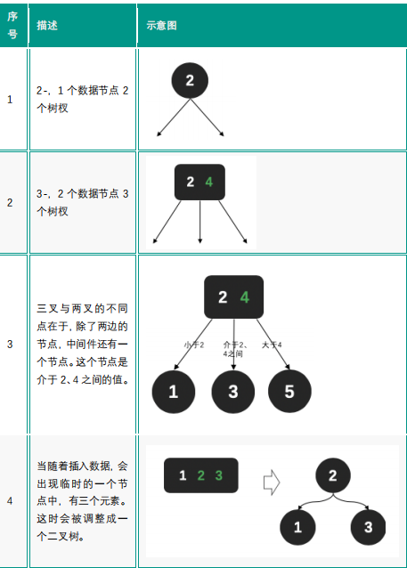
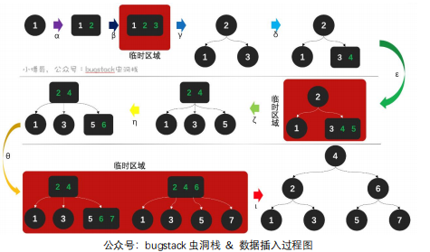
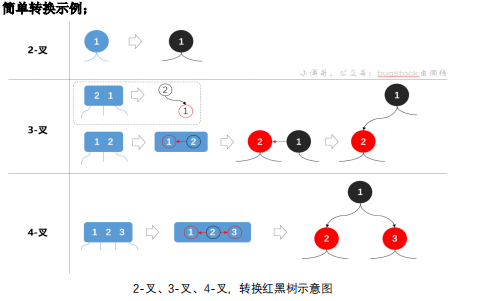
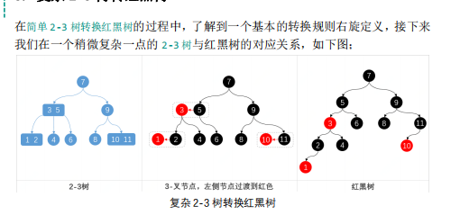

# HashMap

HashMap 是一种 K.V 键值对形式的数据结构

它使用hashCode 来确认key存放的位置

主要的知识点有散列实现、扰动函数、初始化容量、负载因子、扩容机制、以及链表树化

## 散列表实现

散列表就是将一组数据打乱分布在数组当中，可以利用大数取余的方法
key.hashCode() & (tab.length - 1)
​​

## 扰动函数

扰动函数是为了将key 更均匀的分布在 数组中， HashCode为32位，为了更均匀的分布，可以将高位和地位进行异或运算，使得key更有随机性，

HashCode^(HashCode>>16)



## 初始化容量

因为hashMap扩容及存放都是2的倍数为基准，所以在初始化数组时，需要找到所提供的最小的一个接近所给值的基准

```
static final int tableSizeFor(int cap) {
        int n = cap - 1;
        n |= n >>> 1;
        n |= n >>> 2;
        n |= n >>> 4;
        n |= n >>> 8;
        n |= n >>> 16;
        return (n < 0) ? 1 : (n >= MAXIMUM_CAPACITY) ? MAXIMUM_CAPACITY : n + 1;
    }
```

2-->4-->8-->16-->32

- MAXIMUM_CAPACITY = 1 << 30，这个是临界范围，也就是最大的 Map 集合。
- 每次都是无符号右移动1 2 4 8 位，这是为了生成类似11111 最后+1 即可变为2的倍数

这是因为哈希表的实现通常使用按位与操作来计算元素的存储位置，使用2的幂次方作为容量可以更高效地分配桶的位置，提高哈希表的性能

## 负载因子

已占位的数量与总数量的比，这个值用来权衡空间和时间的平衡，

默认是0.75

## 扩容机制

jdk1.8 之前扩容需要重新计算hashcode 然后放入新数组，jdk1.8之后进行了优化，

只需要计算hashcode & 扩容新增的长度 如果结果为1 则增加到扩容位数16+8 ，否则就放在原位置

就相当于 4%8 和12%8 取模后都是4 当数组为8时，俩个值都放在8 但其实12比4 大一轮，所以当数组扩大后，12 会被放入一个新位置



## 链表树化

> 条件：

- 数组的长度为64
- 链表的长度大于8

‍

## 2-3树 与 红黑树

2-3树存在的意义在于，普通的搜索树，可能存在最坏情况，即树结构退化为链表，那么其搜索的效率很低的

2-3树节点可以放一个或两个值，那么其子节点就会有两个或三个

- 每个节点有一个或者两个数据，当有三个数据时，需要对树结构进行调整，
- 当前节点有两个数据时，其三个子节点的中间的那个节点， 值需要在当前两个节点之间





红黑树其实是2-3树的一个优化， 因为2-3树中，二节点 三节点的存储很不方便，所以大聪明们把2-3树转化为红黑树



复杂红黑树的转化情况



红黑树所需要满足的条件

- 节点为黑色或者红色
- 两个红色不能连续
- 任意节点到子节点的黑色节点数量相同
- 根节点为黑色

红黑树的插入操作，主要通过 **左旋转 右旋转 着色** 三种方式来调整树结构的特征

‍

‍