# Netty

[10-网络编程-课堂笔记.pdf](http://127.0.0.1:4673/assets/10-网络编程-课堂笔记-20231112132852-pvalxew.pdf)

# BIO 阻塞式IO

调用io的线程会阻塞的等待数据返回 与Linux网络模型中阻塞IO模型类似

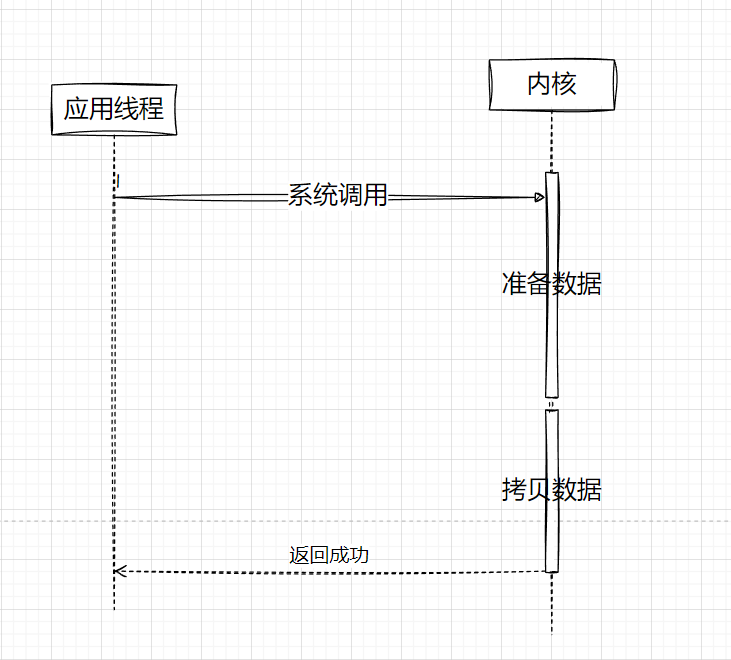

但是在JAVA多了一个Accepter来对接入的接口进行管理

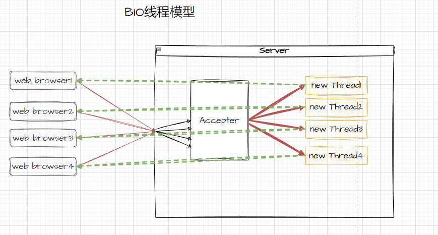

Server

```
   public void run() {
        try {
            serverSocket = new ServerSocket();
            serverSocket.bind(new InetSocketAddress(7397));
            // 线程一直等待请求到达
            while (true) {
                Socket socket = serverSocket.accept();
                BioServerHandler handler = new BioServerHandler(socket, Charset.forName("GBK"));
                handler.start();
            }
        } catch (IOException e) {
            e.printStackTrace();
        }
    }
```

client

```
   public static void main(String[] args) {
        try {
            Socket socket = new Socket("192.168.1.116", 7397);
            BioClientHandler bioClientHandler = new BioClientHandler(socket, Charset.forName("utf-8"));
            bioClientHandler.start();
        } catch (IOException e) {
            e.printStackTrace();
        }
    }
```

‍

# Nio非阻塞式IO

调用io的线程会先获取是否准备好，采取轮训的方式对io线程进行等待，与Linux中非阻塞IO模型类似

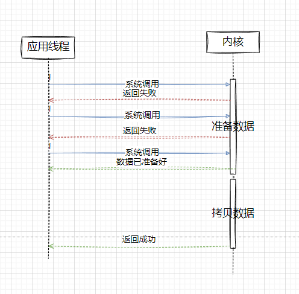

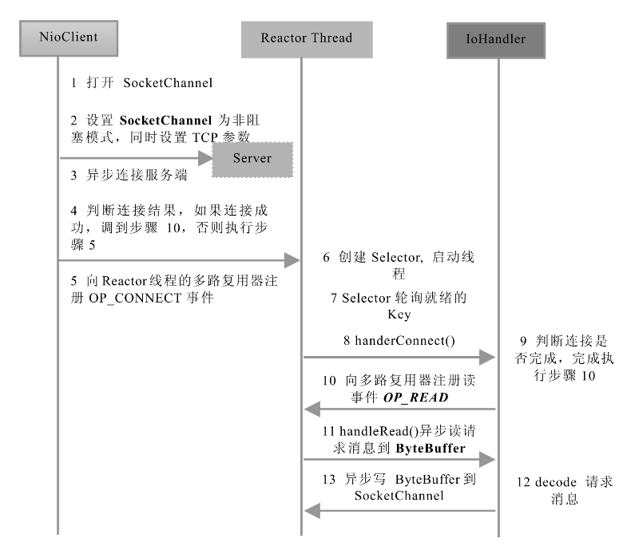


```
//  server
        // 开启一个selector
        Selector selector=Selector.open();
        // 创建channel
        ServerSocketChannel ssc= ServerSocketChannel.open();
        // 开启非阻塞模式
        ssc.configureBlocking(false);
        // 注册key
        // 只监听accept事件
        SelectionKey selectionKey= ssc.register(selector,SelectionKey.OP_ACCEPT,null);
        // 绑定监听的端口号
        ssc.bind(new InetSocketAddress(8080));
```

client

```
 // client
        // 建立客户端的channel
        SocketChannel channel = SocketChannel.open();
        // 连接服务端的IP和端口
        channel.connect(new InetSocketAddress("localhost", 8080));
        // 发送消息
        channel.write(Charset.defaultCharset().encode("hello"));
```

# Aio异步非阻塞式IO

AIO采用 Proactor模式，引入异步通道的概念， 简化了程序编写，一个有效的请求才启动一个线

程，它的特点是先由操作系统完成后，才通知服务端程序启动线程去处理，一般适用于连接数较多

且连接时间较长的应用。

# Netty核心技术

## 概述

Netty 是对NIO 的进一步封装 向用户提供了更方便的调用方式，能够实现 线程组 自定义编码器 解码器 tcp 方式 udp方式 接受http消息 出入站消息管理 以及序列化 和解决半包粘包问题 等操作

> 数据传输过程中有各种情况；整包数据、半包数据、粘包数据，比如我们设定开始符号02、结束符号03； 整包数据；02 89 78 54 03 半包数据；02 89 78 粘包数据；02 89 78 54 03 02 89


## 线程模型

#### 单线程模型

#### 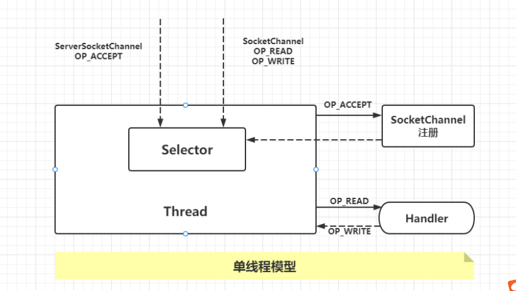线程池模型

#### 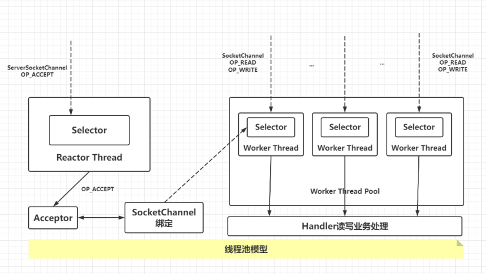Netty所实现的线程模型

单线程Selector

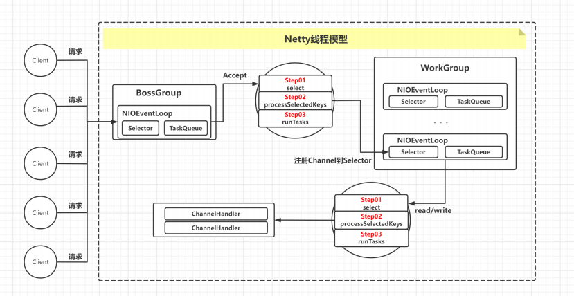线程组Selector

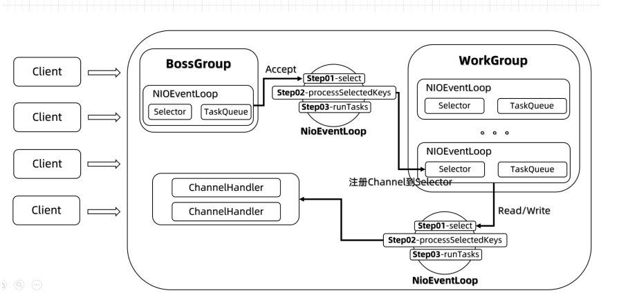

#### 各组件之间的关系

- 两个NioEventLoopGroup线程组**BossGroup** **WorkGroup**
  - BossGroup 负责处理 client的请求
  - WorkGroup 负责处理 BossGroup 所创建的读写任务
- NioEventLoopGroup 表示一组不断循环执行任务的线程
  - 每个group绑定在一个**Selector** ，一个**TaskQueue**，group中含有许多EventLoop
    - 一个Selector可以注册监听多个NioChannel
    - NioChannel只绑定在一个EventLoop
    - NioChannel 都有一个自己的ChannelPipeline

NioEventLoop 内部采用串行化（Pipeline）设计：**责任链模式** *#设计模式#*

消息读取 ==> 解码 ==> 处理（handlers） ==> 编码 ==> 发送，始终由IO线程NioEventLoop 负责

类似于Redis 的单线程处理一系列模式

#### 工作流程

1. BossGroup
   1. 轮训Accept事件
   2. 处理Accept事件
      1. 与client建立连接 创建NioSocketChannel 注册到 WorkGroup的Selector上
      2. 创建runTask
2. WorkGroup
   1. 监听读写事件
   2. 根据注册的NiosocketChannel 处理相应的ChannelHandler
   3. 处理runTask
3. NipEventLoop处理任务时 会用到PipeLine ， PipeLine里面有Channel，而Channel中有我们自己定义的Handler

‍

‍

## 核心API

1. **ServerBootstrap 和 Bootstrap**

ServerBootstrap 是 Netty 中的**服务端启动助手**，通过它可以完成服务端的各种配置；

Bootstrap 是 Netty 中的**客户端启动助手**，通过它可以完成客户端的各种配置。

常用方法：

- 服务端**ServerBootstrap**
  - ServerBootstrap **group**(parentGroup , childGroup)， 该方法用于设置两个EventLoopGroup，连接线程组和工作线程组
  - public B **channel**(Class<? extends C> channelClass)，该方法用来设置服务端或客户端通道的实现类型
  - public B **option**(ChannelOption option, T value)，用来给 ServerChannel 添加配置
  - public ServerBootstrap **childOption**(ChannelOption childOption, T value)，用来给接收通道添加配置
  - public ServerBootstrap **childHandler**(ChannelHandler childHandler)，该方法用来设置业务处理类（自定义handler）
  - public ChannelFuture **bind**(int inetPort) ，该方法用于设置占用端口号
- 客户端**Bootstrap**
  - public B **group**(EventLoopGroup group) ，该方法用来设置客户端的 EventLoopGroup
  - public B **channel**(Class<? extends C> channelClass)，该方法用来设置服务端或客户端通道的实现类型
  - public ChannelFuture **connect**(String inetHost, int inetPort) ，该方法用来配置连接服务端地址信息，host:port

‍

1. EventLoopGroup

①BossEventLoopGroup专门负责接收客户端连接

②WorkerEventLoopGroup专门负责网络读写操作。

‍

1. ChannelHandler 及其实现类

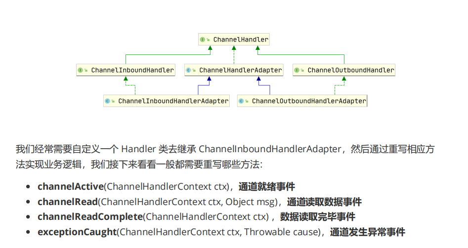

1. ChannelPipeline

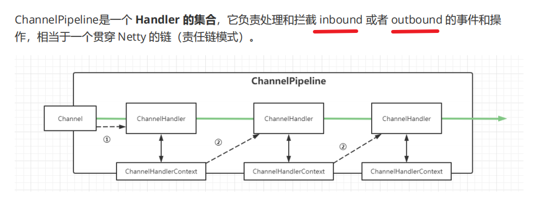

‍

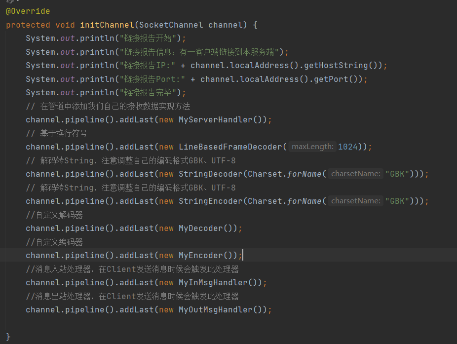

1. ChannelHandlerContext

ChannelHandlerContext是事件处理器上下文对象 在PipeLine 链式调用中传递的上下文对象

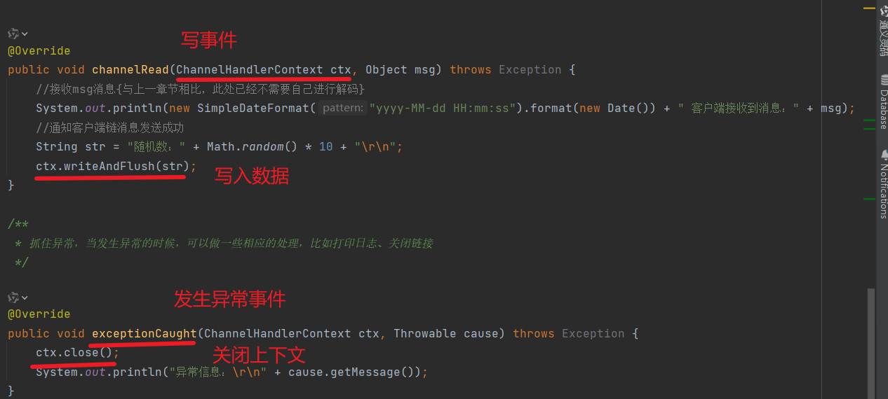

1. ChannelOption
2. ChannelOption.SO_BACKLOG：用来初始化服务器可连接队列大小，对应 TCP/IP 协议 listen 函数中的 backlog 参数。
   1. 服务端处理客户端连接请求是顺序处理的，所以同一时间只能处理一个客户端连接。
   2. 如果请求连接过多，服务端将不能及时处理，多余连接放在队列中等待，backlog 参数指定了等待队列大小。
3. ChannelOption.SO_KEEPALIVE ，连接是否一直保持（是否长连接）。
4. ChannelFuture

ChannelFuture表示 Channel 中**异步 IO 操作的未来结果**，在 Netty 中异步IO操作都是直接返回，调用者并不能立刻获得结果，但是可以通过 ChannelFuture 来获取 IO 操作的处理状态。Netty异步非阻塞处理事件，如果事件很费时，会通过Future异步处理，不会阻塞。

> 比如写入数据后 我们不知道对方何时接受完毕 也不知道何时可以关闭通道，可以使用ChannelFuture.close()方法进行异步的关闭操作

1. Unpooled 类

Unpooled 是 Netty 提供的一个专门用来操作缓冲区的工具类

**常用方法：**

- ByteBuf copiedBuffer(CharSequence string, Charset charset)，通过给定的数据和字符编码返回

  一个 ByteBuf 对象（类似于 NIO 中的 ByteBuffer 对象）

## 客户端与服务端通信案例

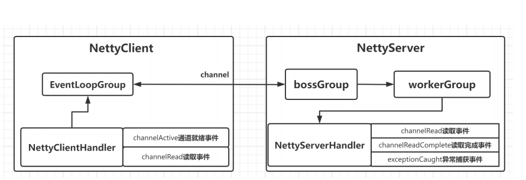

Server端

```
public class NettyServer {
  
    /**
     * 连接服务器
     *
     * @param host 服务器地址
     * @param port 服务器端口号
     */
    private void connect(String host, int port) {
        // 创建Boss线程组
        EventLoopGroup parent = new NioEventLoopGroup();
        // 创建Worker线程组
        EventLoopGroup child = new NioEventLoopGroup();
        try {
            // 创建服务器端Bootstrap
            ServerBootstrap serverBootstrap = new ServerBootstrap();

            //  UDP 的方式
//            Bootstrap bootstrap= new Bootstrap();
//            bootstrap.group(parent).channel(NioDatagramChannel.class)
//                    .handler(new MyChannelInitializer());

            // 设置服务器端线程组和通道类型
            serverBootstrap.group(parent, child)
                    // 初始化服务器连接数量
                    .option(ChannelOption.SO_BACKLOG, 0)
                    .channel(NioServerSocketChannel.class)
                    // 设置通道处理器
                    .childHandler(new MyChannelInitializer());
            // 绑定端口号并同步等待连接完成
            ChannelFuture future = serverBootstrap.bind(port).sync();
            // 关闭服务器通道
            future.channel().closeFuture().sync();
        } catch (Exception e) {
            e.printStackTrace();
        } finally {
            // 关闭线程组
            parent.shutdownGracefully();
            child.shutdownGracefully();
        }
    }
}
```

client

```
public class ApiTest {
    public static void main(String[] args) {
        EventLoopGroup workerGroup = new NioEventLoopGroup();
        try {
            Bootstrap b = new Bootstrap();
            b.group(workerGroup);
            b.channel(NioSocketChannel.class);
            b.option(ChannelOption.AUTO_READ, true);
            b.handler(new ChannelInitializer<SocketChannel>() {
                @Override
                protected void initChannel(SocketChannel channel) throws Exception {
                    //对象传输处理
                    channel.pipeline().addLast(new ObjDecoder(TransportProtocol.class));
                    channel.pipeline().addLast(new ObjEncoder(TransportProtocol.class));
                    // 在管道中添加我们自己的接收数据实现方法
                    channel.pipeline().addLast(new ChannelInboundHandlerAdapter() {
                        @Override
                        public void channelRead(ChannelHandlerContext ctx, Object msg) throws Exception {
                            // 读取消息处理逻辑
                        }
                    });
                }
            });
            ChannelFuture f = b.connect("127.0.0.1", 7397).sync();
            // 向服务端发送信息
            f.channel().writeAndFlush(tp1);
            f.channel().closeFuture().syncUninterruptibly();
        } catch (InterruptedException e) {
            e.printStackTrace();
        } finally {
            workerGroup.shutdownGracefully();
        }
    }
}
```

## 编码和解码

### 为什么要进行编码和解码？

比如我们网络传输数据 传输对象这种类型，它自身有一些格式，会占用一部分内存，我们只传递二进制数据，接收后再反序列化为类，通过这种方式可以减少**网络传输的数据量**

发送数据进行编码

对象--》字符串

接收对象进行解码

字符串--》对象

‍

其实 Java 的序列化技术就可以作为 codec 去使用，但是它的硬伤太多：

1. 无法跨语言，这应该是 Java 序列化最致命的问题了
2. 序列化后的体积太大，是二进制编码的 5 倍多
3. 序列化性能太低

Netty 自身提供了一些 编解码器，如下：

- StringEncoder对字符串数据进行编码
- ObjectEncoder对 Java 对象进行编码

‍

想要更进一步降低可以使用Google 的 Protobuf

‍