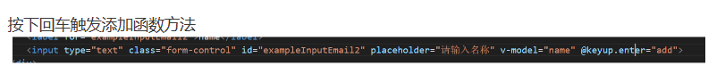
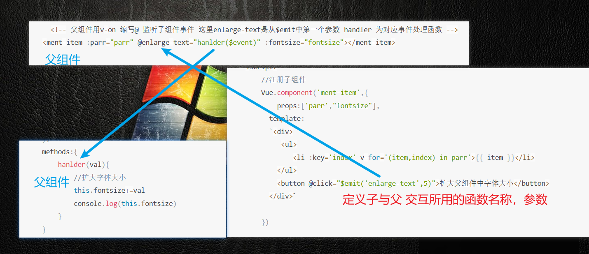
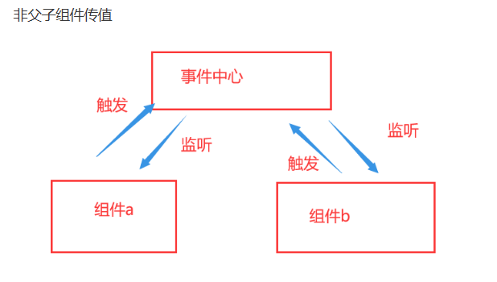
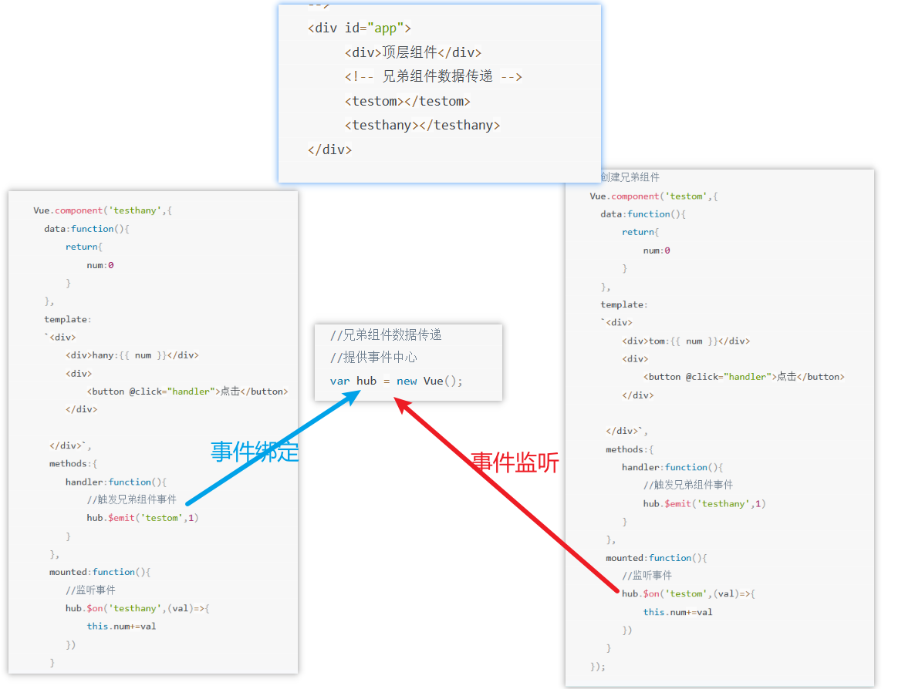

# 前端实训

‍

* div 块级元素  自动换行 设置宽高的

span  行内元素   不自动换行  内容撑开高度

‍

css  选择

```java
/* 引入第一朵云 后代加过滤 */
     section div:nth-child(1){
        /* 引入背景照片 */
        background: url("img/cloud_one.png");
         /* 动画     名称  时间  匀速 循环播放*/
         animation: play 50s linear infinite;
     }


 section{
//  启动动画    动画名称  动画时间  线性进行  无限循环
        animation: bg 25s linear infinite;
     }
//  定义动画类型
     @keyframes bg{
        0%{
            /* 背景颜色 */
           background: #007fd5;
        }
        100%{
             /* 背景颜色 */
           background: #007fd5;
        }
     }
```

‍

超出部分隐藏

​`overflow：hidden`​

‍

### 头像放大旋转

```css
		.box:hover{
            /* css 2d 旋转 放大 倾斜... */
            transform: rotate(360deg) scale(1.5);
        }
```

‍

‍

js数据类型

​`​ <!-- 使用v-cloak能够解决插值表达式闪烁的问题 能够前后拼接任意数据 -->`​

‍

所谓的闪烁是指  有时候网速较慢的时候   会显示`{{ msg }}`​  然后才加载出 msg 具体的内容

可以使用

```css
 
<style>     //  防止父元素的样式覆盖，  加上权值最大
        [v-cloak]{
            display:none !important;
        }
</style>
<p v-cloak>+++++{{msg}}-----</p>
```

‍

‍

提示信息   鼠标移入显示悬浮信息

```css
    <!-- v-bind 是vue中提供属性绑定指令 -->  
        <!-- <input type="button" value="按钮" v-bind:title="mytitle+'abc'"> -->
         <!-- 注意v-bind 可以被简写成 ：要绑定属性 -->
         <input type="button" value="按钮" :title="mytitle+'abc'">
```

‍

```css
  <!-- vue事件修饰符
        .stop 阻止冒泡   不触发父级
        .prevent 阻止默认事件		例如不跳转
        .capture 添加事件侦听器使用事件捕获模式  当别的点击触发此事件
        .self 只当事件该元素本身（不是子元素 ）触发回调   爷 父  子   点击子 不响应父   点击父才响应父
        .once 事件只触发一次 -->		
        <!-- .stop 阻止冒泡 从内到外 -->
```

‍

vue 样式

```css
   <div id="app">
        <!-- 直接再元素上通过：style的形式 书写样式对象 -->
        <h1 :style="{ color:'red','font-size':'50px' }">我是一个傻瓜的h1</h1>
        <!-- 可以抽取样式对象到data里面 -->
        <h1 :style="[styleobj,styleobj1]">这是一个很好的h1</h1>
    </div>
    <script>
     var vm = new Vue({
        el:'#app',
        data:{
            msg:'欢迎学习vue',
            styleobj:{ color:'red','font-size':'50px' },
            styleobj1:{ 'background':'yellow'}
        }  
     })
```

‍

‍

```css
 		 <!-- v-if较高的切换消耗
        直接删除和创建dom节点 
         如果元素涉及到频繁删除切换 最好不要用v-if 而是推荐使用v-show
         如果元素可以永远不会显示被用户看到 则推荐使用v-if -->
        <p v-if="false">这是v-if控制的元素</p>
         <!-- v-show有较高的渲染消耗
         v-show特点 每次不会进行dom节点删除和创建操作
         只是切换了元素的css样式 display：none隐藏 -->
        <p v-show="false">这是v-show控制的元素</p>
```

‍

‍

遍历删除

```css
 var index =  this.list.findIndex(item=>{
                if(item.id==id){
                    return true;
                }
              })
              //调用splice删除对应索引的数据
              this.list.splice(index,1)
```

‍

vue 过滤器

```css
  <p>{{ msg | msgFormat('帅气') }}</p>

//  .......
js：
 Vue.filter('msgFormat',function(msg,arg){
            //字符串replace方法 定义一个正则
            return msg.replace(/坏坏/g,arg)
        })
```

时间格式过滤

```css
  //定义时间格式化全局过滤器
    Vue.filter('dateFormat',function(ctime,pattern='yyyy-mm-dd hh:mm:ss'){
     //根据给定时间字符串 得到特定时间
      var date = new Date(ctime)
    //   年
    var y = date.getFullYear()
    var m = date.getMonth()+1
    var d = date.getDate()
    // return y+"-"+m+'-'+d

    //优化时分秒 先都转为小写
     if(pattern.toLowerCase()==='yyyy-mm-dd'){
      return `${y}-${m}-${d}`
     }else{
        //获取时分秒
       var hh =  date.getHours()
       var mm = date.getMinutes()
       var ss = date.getSeconds()
       return `${y}-${m}-${d} ${hh}:${mm}:${ss}`
     }
    })
```

‍

‍

回车按键事件 

​​

‍

‍

vue 自定义指令

```css
 Vue.directive('focus', {

            bind: function (el) {//每当指令绑定到元素上 会立即执行bind函数 执行一次
                //注意 在每个函数中第一个参数永远el 表示绑定的元素 是一个原生js对象
                //只有插入dom元素 才能获取焦点
                // el.focus()

            },
            inserted: function (el) { //表示插入dom的时候 会执行此函数
                el.focus()
            }

        }),
```

‍

‍

vue生命周期

什么是生命周期 ？

* 从vue实例创建 运行 到销毁期间 总伴随各种各种各样事件 这些事件成为i生命周期
* 生命周期钩子函数：就是生命周期事件别名
* 生命周期钩子 = 生命周期函数 = 生命周期事件 创建期间
* beforecreate 实例刚在内存被创建出来 但是data methods等还没有真正实例化
* created 实例已经内存创建ok data methods 创建ok
* beforemount 从事完成模板编译 但是还未挂在到页面
* mounted 模板编译好了 数据挂载到页面 运行期间
* beforeupdate 状态更新 之前执行此函数 data中状态值是最新的 但是显示数据还是旧的
*  updated 状态更新 data状态值是最新的 显示的也是最新 销毁期间
* beforedestroy 实例销毁之前调用 我们实例仍然可用
* destroyed 实例完全销毁

‍

‍

### 侦听器 watch

* 使用watch 来响应数据变化 一般用于异步 或者开销较大的操作
* watch中属性 一定是data 已经存在数据 当监听一个对象改变时，
* 普通的watch无法监听对象内部属性改变 只有data中数据才能监听到变化
* 此时deep属性对对象进行深度监听

‍

‍

### vue组件注册

```css
Vue.component(组件名称，{
    data：组件数据，
    template：组件模板内容
  
})
```

使用

```css
 <div id="app">
        <button-counter></button-counter>
        <button-counter></button-counter>
        <button-counter></button-counter>
        <!-- <HelloWorld></HelloWorld> -->
        <!-- //但是普通标签中 必须使用短横线方式使用组件 -->
        <hello-world></hello-world>
    </div>


```

2 全局注册

```css
 Vue.component('HelloWorld',{
            data:function(){
                return{
                    msg:'helloworld'
                }
            },
            template:'<div>{{ msg }}</div>'
        })
```

 局部注册

```css
var child = {
        template:`<div>我的局部组件内容</div>`
    }
---------------------------

 components:{
         //局部注册组件  my-component 将只在父模板可用 一定要在实例上注册才能在html文件夹使用
          'my-component': child
        }
```

‍

‍

父传子

在子组件定义props数组 用来接收父组件传来的参数   注意大小写  

```css
 <menu-item :menu-title="ptitle" content="hello"></menu-item> 

 Vue.component('menu-item',{
        //子组件使用props接收父组件传递过来数据
        props:['menuTitle','content'],
        data:function(){
            return{
                msg:'子组件内容'
            }
        },
        template:'<div>{{ msg+"---"+menuTitle+"----"+content }}</div>'
    })
```

子传父

子组件定义传递参数的函数，，

```css
<div id="app">
     <!-- 子组件向父组件传值
       1.子组件通过自定义事件向父组件传递消息
       2.父组件监听子组件的事件 -->
      <!-- 父组件用v-on 缩写@ 监听子组件事件 这里enlarge-text是从$emit中第一个参数 handler 为对应事件处理函数 -->
     <ment-item :parr="parr" @enlarge-text="hanlder($event)" :fontsize="fontsize"></ment-item>
      
</div>
```

‍

​​

‍

### 兄弟传值

​​

1.兄弟之间  传递数据需要借助于事件中心，通过事件中心传递数据    

	提供事件中心 var hub 等于 new vue（）  
2.传递数据方 通过一个事件触发 hub.$emit (方法名称，传递数据)  
3.接收数据方 通过mounted（） 钩子函数 触发hub.$on（方法名）  
4.销毁事件 通过hub.$off(方法名) 销毁无法进行传递数据

‍

​​
